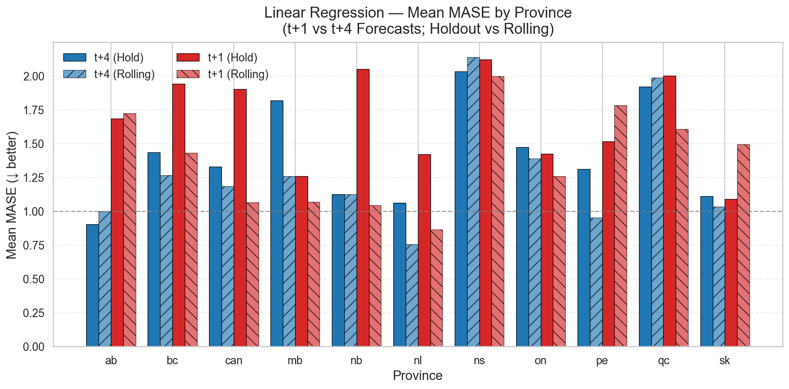

# Are We Building Enough? Forecasting Canadian Housing Starts and Housing Adequacy

This repository develops a reproducible, province-level framework for forecasting housing supply in Canada using open CMHC and Statistics Canada data (1990–2025).  
The work was conducted as part of the Erdős Institute Data Science Bootcamp (Fall 2025).

---

## Project Overview

The goal of this project is to forecast **quarterly housing starts** and evaluate **housing adequacy** by comparing new construction activity with population-driven housing needs.  
By integrating demographic data and simple time series models, we aim to assess whether Canada is building enough homes to keep pace with population growth.

Two key outcomes are modeled:

1. **Housing Starts** — derived from CMHC monthly SAAR (Seasonally Adjusted Annual Rate) data.  
2. **Housing Adequacy Index (HAI)** — a ratio of housing supply to required housing units, defined as  
   
   $\text{HAI}_t = \frac{\text{Housing Starts}_t}{\Delta \text{Population}_t / 2.5}$
   
    where 2.5 represents the assumed average household size (AHS).

---

## Repository Structure

| Folder / File | Description |
|----------------|-------------|
| `data/` | Contains the processed datasets, including `housing_adequacy_dataset.csv`. |
| `utilities/` | Python modules with helper functions for feature creation, tuning, and evaluation. |
| `Executive_Summary/` | Contains the LaTeX executive summary for the project report. |
| `00_data_processing.ipynb` | Converts CMHC monthly SAAR data to quarterly, merges with population data, and computes the HAI. |
| `01_eda.ipynb` | Exploratory data analysis of housing starts, population growth, and adequacy trends. |
| `02_dwelling_sameQ.ipynb` | Forecasts housing starts one year ahead (t+4). |
| `03_dwelling_nextQ.ipynb` | Forecasts housing starts one quarter ahead (t+1). |
| `04_explore_hai.ipynb` | Forecasts Housing Adequacy Index (HAI) using both raw and smoothed versions. |
| `plotly_map.ipynb` | Generates interactive heatmaps of model results and adequacy indicators across provinces. |
| `best_params_cache_*.json` | Cached hyperparameters for tuned models to ensure reproducibility. |

---

## Data and Feature Design

We combine housing starts and population data at the provincial level to build quarterly time series from 1990–2025.  
Key variables include:

- **Housing Starts (SAAR)** — monthly seasonally adjusted annual rates from CMHC, converted to quarterly.  
- **Population** — quarterly population from Statistics Canada.  
- **Population Change** — difference in population between consecutive quarters.  
- **Needed Units** — estimated housing demand (Δpopulation / 2.5).  
- **HAI** — ratio of actual starts to needed units.  

Lag features (1- and 4-quarter) are included to capture persistence and seasonality.

---

## Forecast Setup

We evaluate two forecast horizons:

1. **Next Quarter (t+1)** — short-term forecasting.  
2. **Same Quarter Next Year (t+4)** — seasonal, one-year-ahead forecasting.

Validation is done using two complementary approaches:

- **Holdout Split:** Training up to 2018 and testing on 2019–2025.  
- **Rolling Evaluation:** Retraining each quarter to simulate real-time forecasting performance.

---

## Models Used

We tested a range of models representing both linear and nonlinear methods, as well as a seasonal benchmark:

| Model | Description |
|--------|-------------|
| **Naïve (Seasonal)** | Baseline model using last year’s same-quarter value(for t+4)/previous quarter's value(for t+1). |
| **Linear Regression (LR)** | Captures direct linear relationships between housing starts and demographic factors. |
| **Ridge Regression** | Handles correlated lag features by imposing L2 regularization. |
| **Random Forest (RF)** | Ensemble model capturing nonlinear dependencies and interactions. |
| **Extra Trees Regressor (ETR)** | Ensemble variant using random splits to reduce variance. |
| **XGBoost (XGB)** | Gradient-boosted trees providing flexible nonlinear fits and efficient training. |

All models were **hyperparameter-tuned** using randomized search with cross-validation.  
Each province was modeled separately to reflect differences in population scale, housing cycles, and volatility.

---

## Evaluation Metrics

Performance was assessed using the following metrics:

- **MAE** — Mean Absolute Error  
- **RMSE** — Root Mean Squared Error  
- **sMAPE** — Symmetric Mean Absolute Percentage Error  
- **MASE** — Mean Absolute Scaled Error (primary metric for model evaluation with baseline)

Models were compared against the seasonal naïve baseline (MASE = 1).  
Values below 1 indicate improvement over the baseline.

---

## Results Summary

Across both holdout and rolling evaluations:

- **Linear Regression** consistently performed best overall, with MASE values often below one.  
- At short horizons (t+1), the naïve baseline was hard to beat; Linear and Ridge came closest, with small improvements in some provinces (e.g., NL, MB).  
- At longer horizons (t+4), several models occasionally outperformed the naïve baseline by capturing the annual seasonal pattern.  
- Rolling retraining helped stabilize results over time, particularly in smaller provinces with more volatile data.  
- Overall, the seasonal naïve model remains a strong benchmark, while machine learning models provided modest but interpretable gains.

---

## Summary of Model Performance

---

## Key Insights

- Population growth is the primary driver of long-term housing demand.  
- Housing starts respond to demographic shifts but lag behind during sharp upswings or policy shocks.  
- Simpler models often generalize better, especially with limited historical data per province.  
- Forecasting adequacy (HAI) remains challenging due to the compounding effects of small denominators and volatile starts data.  

---

## Next Steps

- Incorporate higher-frequency macroeconomic indicators (permits, employment, interest rates, CPI).  
- Explore hierarchical or panel-based models for cross-province learning.  
- Extend the HAI framework to project future housing adequacy using Statistics Canada’s population forecasts.  
- Develop probabilistic forecasts to communicate uncertainty in future housing supply.

---

## Acknowledgments

This project was developed by **Anwesha Basu** and **Debanjan Sarkar** as part of the *Erdős Institute Fall 2025 Data Science Bootcamp*.  
We thank the instructors and mentors of the bootcamp for their guidance and the Erdős community for fostering an environment of collaboration and exploration.